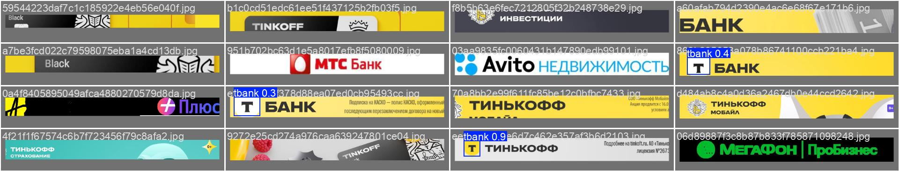
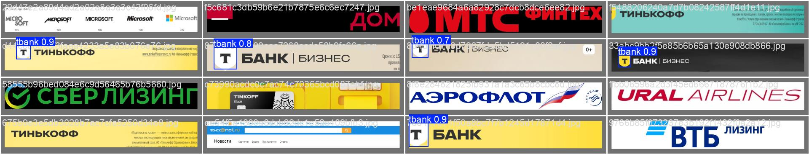

# Детекция логотипа Т-Банка

Проект представляет собой REST API сервис для автоматического обнаружения логотипа Т-Банка на изображениях. Сервис принимает изображения в форматах JPEG, PNG, BMP, WEBP и возвращает координаты найденных логотипов в формате bounding boxes.

## Цель проекта

Разработать систему детекции логотипа Т-Банка, способную:
- Обнаруживать логотипы в различных условиях (разные размеры, углы поворота, освещение)
- Игнорировать логотипы "Тинькофф"
- Обрабатывать изображения за время не более 10 секунд
- Работать на видеокарте с 16GB видеопамяти

## Быстрый запуск

Запуск сервиса осуществляется с помощью docker/podman контейнера и доступен по адресу `http://localhost:8000`:

```sh
docker build -t tbank-logo-detector .
docker run -p 8000:8000 tbank-logo-detector
```

Веса модели скачиваются автоматически при запуске контейнера.
Они доступны для скачивания на [странице релизов](https://github.com/dangooddd/tbank-sirius-cv/releases).

Чтобы избежать скачивания весов при повторном запуске контейнера, можно использовать docker volumes:

```sh
docker volume create weights
docker run -v weights:/app/weights -p 8000:8000 tbank-logo-detector
```

## Пример работы модели





## Структура

> [!Note]
> Подробнее о процессе обучения моделей и обработки данных см. в файле [docs/ML.md](docs/ML.md).
>
> Проведенные эксперименты задокументированы в файле [docs/EXPERIMENTS.md](docs/EXPERIMENTS.md).
> В конце находятся результаты валидации последнего цикла обучения.

```
sirius-ml/
├── src/           # Исходный код проекта и сервиса
├── configs/       # Конфигурационные файлы
├── data/          # Данные для обучения и валидации
├── assets/        # Другие данные
├── weights/       # Веса моделей
├── tests/         # Тесты
├── docs/          # Документация
├── Dockerfile     # Конфигурация Docker
└── pyproject.toml # Зависимости проекта
```

## API документация

Сервис предоставляет единственный эндпоинт:

- **POST /detect** - загрузка изображения и получение результатов детекции

Подробная документация по API доступна после запуска сервиса по адресу `http://localhost:8000/docs`.

## Лицензия

Проект распространяется под лицензией AGPL. Подробнее см. в файле [LICENSE](LICENSE).

В качестве базовых используются модели [Ultralytics YOLO](https://github.com/ultralytics/ultralytics).
